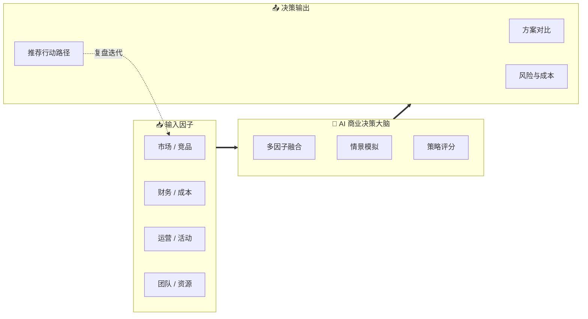
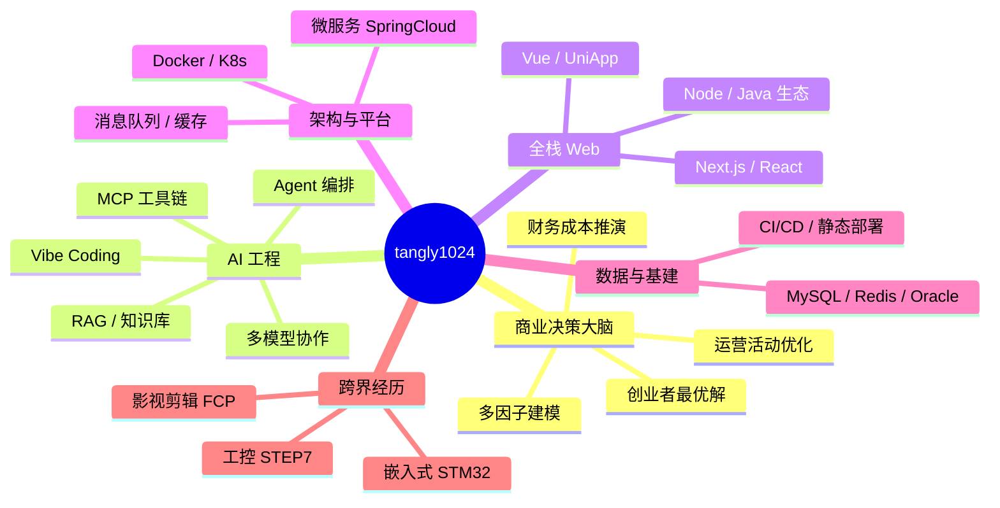
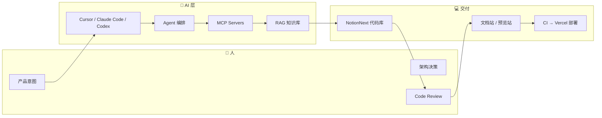
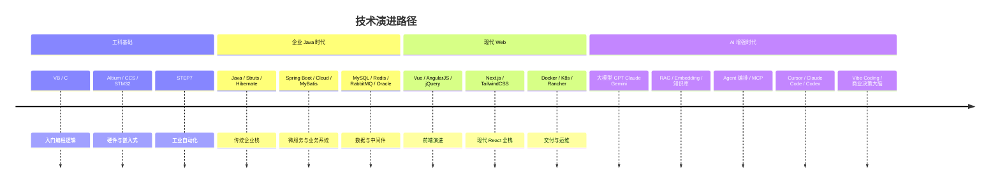

<!-- 顶部动态打字（可选，取消注释即可启用）

  

-->

# Hi，我是 tangly1024

**全栈工程师 · 开源作者 · AI 辅助开发实践者**

电气工程自动化出身，自学转入软件开发多年。  
专注 **Web 全栈、系统架构、Notion 生态**，并持续探索 **大模型、Agent 编排与 Vibe Coding** 在真实项目中的落地。  
当前主攻 **AI 多因子商业决策大脑** — 用计算模型辅助创业者做项目决策、成本与运营的最优应变。

  
  
  
  

  
  

<!-- 统计卡片：跟随 GitHub 浅色 / 深色模式（prefers-color-scheme） -->

  <a href="https://github.com/vn7n24fzkq/github-profile-summary-cards">
    <picture>
      <source media="(prefers-color-scheme: dark)" srcset="https://github-profile-summary-cards.vercel.app/api/cards/profile-details?username=tangly1024&theme=github_dark" />
      <source media="(prefers-color-scheme: light)" srcset="https://github-profile-summary-cards.vercel.app/api/cards/profile-details?username=tangly1024&theme=github" />
      
    </picture>
  </a>
  <a href="https://github.com/vn7n24fzkq/github-profile-summary-cards">
    <picture>
      <source media="(prefers-color-scheme: dark)" srcset="https://github-profile-summary-cards.vercel.app/api/cards/stats?username=tangly1024&theme=github_dark" />
      <source media="(prefers-color-scheme: light)" srcset="https://github-profile-summary-cards.vercel.app/api/cards/stats?username=tangly1024&theme=github" />
      
    </picture>
  </a>
  <a href="https://github.com/vn7n24fzkq/github-profile-summary-cards">
    <picture>
      <source media="(prefers-color-scheme: dark)" srcset="https://github-profile-summary-cards.vercel.app/api/cards/repos-per-language?username=tangly1024&theme=github_dark" />
      <source media="(prefers-color-scheme: light)" srcset="https://github-profile-summary-cards.vercel.app/api/cards/repos-per-language?username=tangly1024&theme=github" />
      
    </picture>
  </a>

---

## 🚀 我在做什么

### 🔥 当前在研：AI 多因子商业决策大脑

正在开发一套 **AI 驱动的商业决策辅助系统**，面向创业者与项目团队，把分散的经营信号收敛为可计算的决策模型，在关键节点给出更优的应变路径。

| 能力域 | 做什么 |
|--------|--------|
| **项目决策** | 多因子建模，辅助方向选择、资源取舍与阶段判断 |
| **财务成本** | 成本结构拆解、现金流与投入产出推演 |
| **运营活动** | 活动效果预估、渠道与节奏的组合优化 |
| **决策引擎** | 推出可复用的计算模型，帮助创业者针对具体项目找到 **更优解** 而非拍脑袋 |

<b>📊 决策流程示意（点击展开）</b>

 

> 目标：让「该不该做、怎么做、代价是什么」变得 **可量化、可对比、可迭代**。

---

| 方向 | 说明 |
|------|------|
| **当前在研** | **AI 多因子商业决策大脑** — 项目决策 · 财务成本 · 运营活动 · 最优解计算模型 |
| **开源产品** | [NotionNext](https://github.com/tangly1024/NotionNext) — Next.js + Notion API 的高颜值静态博客，25+ 主题、文档站、预览站、社区治理 |
| **个人品牌** | [tangly1024.com](https://tangly1024.com) — 作品展示、主题体验与内容入口 |
| **工程方法** | 全栈交付 + 架构演进 + **AI 增强开发**（Vibe Coding、Agent、MCP、RAG） |
| **社区** | GitHub Issues / Discussions、文档共建、欢迎 PR 与想法交流 |

---

## 🧠 能力全景（可视化）

---

## 🤖 AI 工程与 Vibe Coding

> 把大模型当作**结对架构师 + 执行引擎**，而不是聊天玩具。

| 类别 | 工具 / 概念 | 我在项目里的用法 |
|------|-------------|------------------|
| **IDE / Agent** | Cursor、Claude Code、Codex、Antigravity 等 | 需求拆解、重构、测试补全、跨文件改动与 Code Review |
| **编排** | Agent 工作流、多步任务、Subagent | 文档迁移、主题批量改造、Issue → PR 闭环 |
| **协议** | **MCP**（Model Context Protocol） | 浏览器自动化、Notion/文档检索、与设计/部署工具联动 |
| **检索** | **RAG**、向量库、知识切片 | 项目文档问答、教程检索、社区 FAQ 辅助 |
| **模型** | GPT / Claude / Gemini 等（按场景选型） | 写作、代码生成、架构评审、国际化文案 |
| **方法论** | **Vibe Coding** | 自然语言驱动迭代：快速原型 → 人工把关 → 可维护代码 |

---

## 🏗️ 全栈与架构

| 层级 | 技术栈 | 典型场景 |
|------|--------|----------|
| **前端** | Next.js、React、Vue、UniApp、TailwindCSS、Bootstrap | 博客主题、文档站、移动端 H5、组件化 UI |
| **后端** | Java、Spring Boot、Spring Cloud、Netty、Python、Flask、PHP | API、微服务、中间件集成、脚本与工具链 |
| **数据** | MySQL、Redis、Oracle、MyBatis、Hibernate | 业务库、缓存、ORM、读写分离 |
| **消息 / 集成** | RabbitMQ、Redis Pub/Sub | 异步任务、削峰、服务解耦 |
| **云原生** | Docker、Kubernetes、Rancher | 容器化、编排、多环境部署 |
| **架构思维** | 模块化、主题插件化、文档即代码、开源治理 | NotionNext 多主题架构、双分支升级策略、社区协作流程 |

<!-- srcset 里逗号会截断 URL，仅对 <source> 使用 %2C； 可正常用逗号 -->

  <a href="https://skillicons.dev">
    <picture>
      <source media="(prefers-color-scheme: dark)" srcset="https://skillicons.dev/icons?i=js%2Cts%2Creact%2Cnextjs%2Cvue%2Cjava%2Cspring%2Cdocker%2Ckubernetes%2Cpython%2Credis%2Cmysql%2Cnotion%2Cgit%2Cgithub%2Cvercel&amp;theme=dark&amp;perline=8" />
      <source media="(prefers-color-scheme: light)" srcset="https://skillicons.dev/icons?i=js%2Cts%2Creact%2Cnextjs%2Cvue%2Cjava%2Cspring%2Cdocker%2Ckubernetes%2Cpython%2Credis%2Cmysql%2Cnotion%2Cgit%2Cgithub%2Cvercel&amp;theme=light&amp;perline=8" />
      
    </picture>
  </a>

---

## 🛠️ 技术时间线（由工控到 Web 再到 AI）

<b>📦 完整技术清单（点击展开）</b>

| 领域 | 技术 |
|------|------|
| **AI / 大模型** | GPT、Claude、Gemini 等（按场景选型）；开源 LLM；多模型对比与路由 |
| **AI 工程** | RAG、向量检索、Embedding、知识库切片、Prompt Engineering |
| **Agent 编排** | Multi-Agent、工作流编排、Subagent、工具调用（Tool Use）、任务分解与闭环 |
| **协议与集成** | **MCP**（Model Context Protocol）、Function Calling、API / Webhook 联动 |
| **AI 开发工具** | **Cursor**、**Claude Code**、**Codex**、Antigravity、GitHub Copilot |
| **方法论** | **Vibe Coding**、AI 结对编程、人机协同 Code Review |
| **应用场景** | 文档 RAG、Issue→PR 自动化、架构评审、国际化、商业决策建模（在研） |
| 语言 | VB、C、Java、Python、PHP、JavaScript、TypeScript |
| 前端 | jQuery、AngularJS、Vue、UniApp、Next.js、React、TailwindCSS、Bootstrap |
| 后端 | Struts、Hibernate、Spring Boot、Spring Cloud、Netty、Flask、MyBatis |
| 数据 | MySQL、Redis、Oracle |
| 中间件 | RabbitMQ |
| 嵌入式 / 工控 | STM32、Code Composer Studio、STEP7 |
| 设计 / 其他 | Altium Designer、Final Cut Pro |
| 基础设施 | Docker、Kubernetes、Rancher、Vercel、CI/CD |

---

## ⭐ 精选项目

| 项目 | 描述 | 链接 |
|------|------|------|
| **AI 商业决策大脑** | 多因子决策 · 财务成本 · 运营活动 · 创业者最优解模型（在研） | 敬请期待 |
| **NotionNext** | Notion 驱动的静态博客系统，多主题、文档站、预览站 | [GitHub](https://github.com/tangly1024/NotionNext) · [文档](https://notionnext.tangly1024.com) · [预览](https://preview.tangly1024.com) |
| **个人站** | 主题展示、内容与品牌入口 | [tangly1024.com](https://tangly1024.com) |

---

## 📬 联系我

对 **开源协作、架构讨论、AI 工程实践、NotionNext 定制** 感兴趣，欢迎交流：

- 🌐 站点：[https://tangly1024.com](https://tangly1024.com)
- 💬 GitHub：[Issues](https://github.com/tangly1024/NotionNext/issues) / [Discussions](https://github.com/tangly1024/NotionNext/discussions)

---

**用代码连接 Notion 与创作者，用 AI 放大工程效率。**

Profile README · 持续更新中

